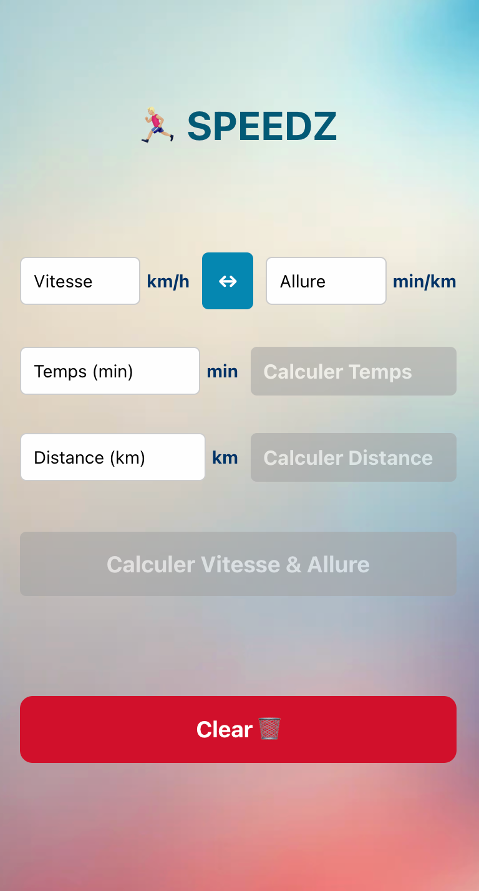

# Simple Speed and Pace Convertor

## About

As I've been back to running for a few weeks now. I needed this kind of tool and I didn't want to use already existing one's but instead create my own.

It has a main feature to convert Speed to Pace and vice versa.
And base to this speed or pace, and time or distance It also give equivalents missing values.

Initially this was a project to try Ios App development but Thank's (🖕🏼) to developper subscription 99$/year -> it end as a PWA on vercel.

## Technicals

Update project :
1. Build with `npx expo export:web`
2. Push to vercel with `vercel --prod`
